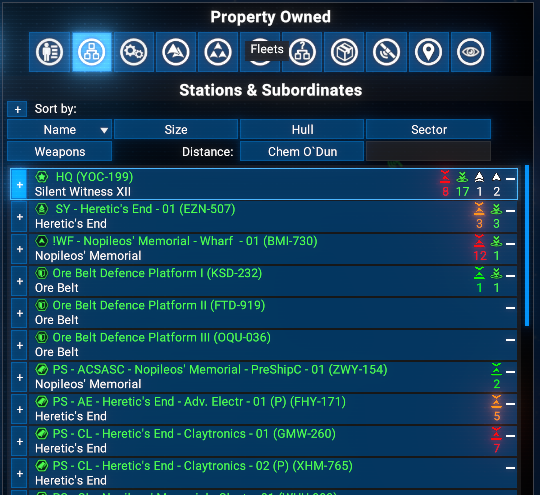
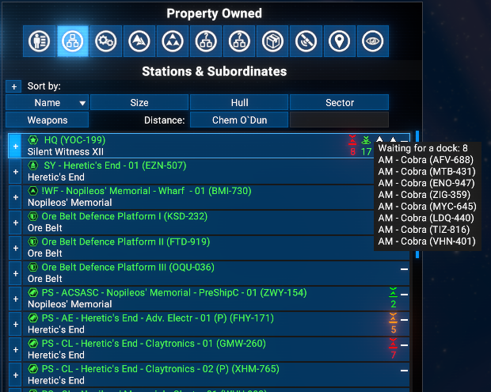
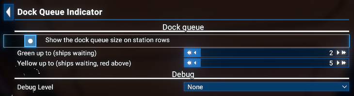

# Dock Queue Indicator

Shows how many ships are waiting for a free dock at each of your stations, right in the map's Property Owned list. If you never see it, your stations are doing fine.

## Features

- A queue icon with the number of waiting ships appears on every station row of the Property Owned list, first in the row, before the docked-ships icon.
- The number is green, yellow or red depending on the queue size; both thresholds are set in Extension Options.
- Hovering over the icon lists the waiting ships by name.
- Counts every ship that was put into the station's docking queue, your own and NPC traders alike, and drops it again as soon as it gets a dock, docks, gives up or is destroyed.
- Can be switched off in Extension Options without removing the mod.

## Limitations

- The list has room for five icons per row. A station that already shows five ship classes collapses the last one into "..." when the queue icon is added, exactly as the game does for a sixth class.
- Ships already waiting when the mod is first loaded are picked up only when they request docking again.

## Requirements

- **X4: Foundations**: Version **8.00HF4** or higher and **UI Extensions and HUD**: Version **v8.0.4.10** or higher by [kuertee](https://next.nexusmods.com/profile/kuertee?gameId=2659).
  - Available on Nexus Mods: [UI Extensions and HUD](https://www.nexusmods.com/x4foundations/mods/552)
- **X4: Foundations**: Version **9.00** or higher and **UI Extensions and HUD**: Version **v9.0.0.7** or higher by [kuertee](https://next.nexusmods.com/profile/kuertee?gameId=2659).
  - Available on Nexus Mods: [UI Extensions and HUD](https://www.nexusmods.com/x4foundations/mods/552)
- **Mod Support APIs**: Version **1.95** or higher by [SirNukes](https://next.nexusmods.com/profile/sirnukes?gameId=2659).
  - Available on Steam: [SirNukes Mod Support APIs](https://steamcommunity.com/sharedfiles/filedetails/?id=2042901274)
  - Available on Nexus Mods: [Mod Support APIs](https://www.nexusmods.com/x4foundations/mods/503)
- **Options Helper**: Version **1.10** or higher by [Chem O`Dun](https://next.nexusmods.com/profile/ChemODun/mods?gameId=2659).
  - Available on Steam: [Options Helper](https://steamcommunity.com/sharedfiles/filedetails/?id=3715253556)
  - Available on Nexus Mods: [Options Helper](https://www.nexusmods.com/x4foundations/mods/2155)
- **Print Extension List**: Version **1.00** or higher by [Chem O`Dun](https://next.nexusmods.com/profile/ChemODun/mods?gameId=2659).
  - Available on Steam: [Print Extension List](https://steamcommunity.com/sharedfiles/filedetails/?id=3770927339)
  - Available on Nexus Mods: [Print Extension List](https://www.nexusmods.com/x4foundations/mods/2191)

## Installation

You can download the latest version via Steam client - [Dock Queue Indicator](https://steamcommunity.com/sharedfiles/filedetails/?id=3814885746)
Or you can do it via the Nexus Mods - [Dock Queue Indicator](https://www.nexusmods.com/x4foundations/mods/2430)

## Save state

**No** (removing the extension does not break saves).

## Usage

Open the map and the Property Owned list. Every station with ships waiting for a dock shows the queue icon with the count as the first icon of its row, before the docked-ships icon.

Hover over the icon to see which ships are waiting.

In Extension Options, under Dock Queue Indicator:

- **Show the dock queue size on station rows** switches the icon on and off.
- **Green up to** is the largest queue still shown in green.
- **Yellow up to** is the largest queue shown in yellow; anything above is red.
- **Debug Level** controls how much the mod writes to the game log.

## Credits

- Author: Chem O`Dun, on [Nexus Mods](https://next.nexusmods.com/profile/ChemODun/mods?gameId=2659) and [Steam Workshop](https://steamcommunity.com/id/chemodun/myworkshopfiles/?appid=392160)
- *"X4: Foundations"* is a trademark of [Egosoft](https://www.egosoft.com).

## Acknowledgements

- [EGOSOFT](https://www.egosoft.com) for the X series.
- [kuertee](https://next.nexusmods.com/profile/kuertee?gameId=2659) for UI Extensions and HUD, which provides the map list hooks.
- [SirNukes](https://next.nexusmods.com/profile/sirnukes?gameId=2659) for the Mod Support APIs.

## Changelog

### [1.00] - 2026-10-06

- Added
  - Initial public version
